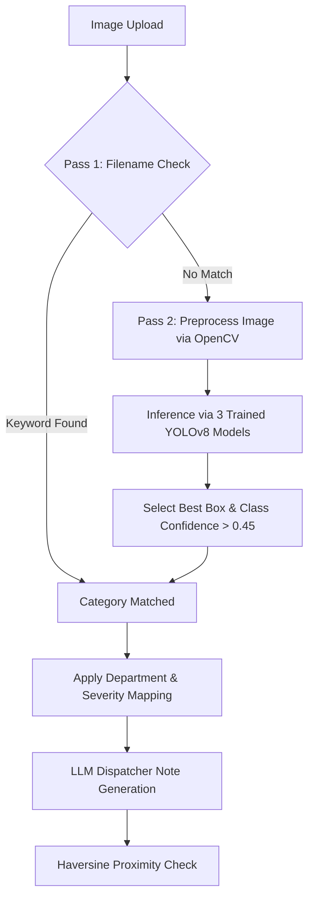
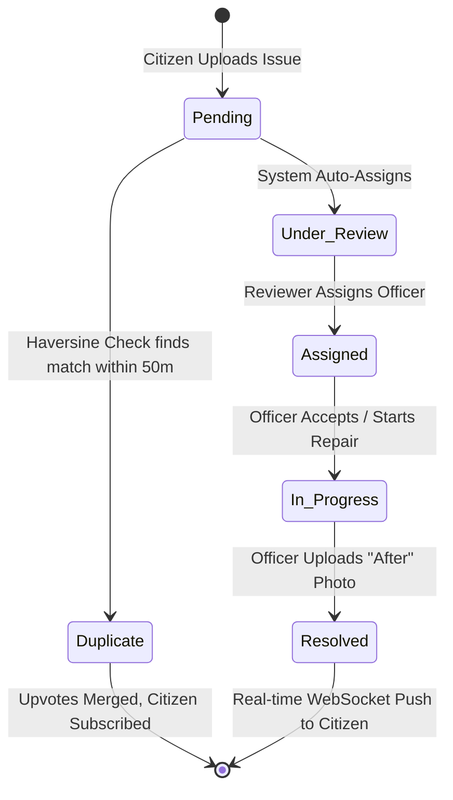

# CiviTrack AI: Detection Pipeline & System Workflows

This document details the exact technical implementation of the **AI Detection Pipeline** and the **End-to-End Resolution Workflow** in CiviTrack AI.

---

## 1. The Detection Pipeline

The detection pipeline automates the extraction of structural data from an unorganized citizen report (an image file and GPS coordinates). It operates as a multi-stage sequential flow.

### A. Pass 1: Filename Keyword Parsing
When a file is received, the backend inspects the base filename (converted to lowercase). It checks for predefined substring patterns:
* **Pothole / Damaged Road**: `"pothole"`, `"road damage"`, `"damaged road"`
* **Garbage**: `"garbage"`, `"trash"`, `"waste"`, `"dump"`
* **Open Manhole**: `"manhole"`, `"open manhole"`
* **Water Leakage**: `"water leak"`, `"pipe leak"`, `"leakage"`
* **Flooded Road**: `"flood"`, `"waterlogging"`, `"waterlogged"`
* **Fallen Tree**: `"fallen tree"`, `"tree branch"`
* **Electric Pole**: `"electric pole"`, `"utility pole"`, `"damaged pole"`
* **Streetlight**: `"streetlight"`, `"street light"`, `"broken light"`
* **Traffic Sign**: `"traffic sign"`, `"stop sign"`, `"broken sign"`

If a substring match is found, the system skips standard model execution, returns the category label, and sets the confidence score to **0.98**. This serves as a high-speed bypass that reduces computational load.

### B. Pass 2: Custom-Trained YOLOv8 Models
If Pass 1 fails, the system executes three custom-trained **YOLOv8** object-detection models implemented using PyTorch:
1. **Preprocessing (OpenCV)**: Resizes the input image to match the YOLO grid structure (640x640), applies Gaussian blur for noise reduction, and CLAHE (Contrast Limited Adaptive Histogram Equalization) to improve feature details in low-light/monsoon images.
2. **Model 1: `Environmental_Hazards_clean`**: Runs inference to detect pavement and debris issues: *potholes*, *garbage accumulation*, *fallen trees*, *flooded roads*, and *damaged roads*.
3. **Model 2: `Water_Leak_clean`**: Runs inference to locate water infrastructure hazards: *water leaks*, *sewage overflows*, and *open manholes*.
4. **Model 3: `Civic-issues.v1i.yolo26`**: Runs inference to identify utility defects: *broken streetlights*, *damaged electric poles*, and *broken traffic signs*.
5. **Class Resolution**: Aggregates all bounding boxes with confidence scores greater than **0.45**. The highest confidence box is selected as the primary category. If no box exceeds the threshold, the issue is classified as `"None"`.

### C. Severity & Department Routing
The system applies a hardcoded routing policy to map categories to specific government departments and severity rankings:
* **Critical Severity**: open manholes, damaged electric poles, and flooded roads. These issues bypass standard review queues and immediately trigger push notifications to assigned officers.
* **High Severity**: Potholes (assigned to *Roads & Buildings*).
* **Medium Severity**: Garbage accumulation (assigned to *Waste Management*), water leakage (assigned to *Water Supply & Sewerage*), and fallen trees (assigned to *Roads & Buildings*).
* **Low Severity**: Broken streetlights (assigned to *Electricity Board*) and broken traffic signs (assigned to *Roads & Buildings*).

### D. LLM Dispatcher Note Generation
The system generates a descriptive operational log to serve as a dispatcher note:
1. **Template Parsing**: Combines severity, category, district, ward, and coordinates.
2. **Contextual Hazards**: Extracts specific hazards corresponding to the category (e.g., for potholes: *"presents a direct risk to vehicular safety, causing sudden braking and potential rim/suspension damage"*).
3. **Randomized Sentence Selection**: Mixes introduction, body, and conclusion templates to generate natural, professional dispatcher text.

---

## 2. End-to-End Resolution Workflow

The lifecycle of an issue in CiviTrack AI follows a state machine diagram:

### Step 1: Submission
* A resident uploads a photo through the **Web Citizen Portal** or the **WhatsApp Chatbot** (via WhatsApp Cloud API webhooks).
* The server processes the file through the **AI Detection Pipeline**.

### Step 2: Proximity Filtering (Deduplication)
* The **MySQL database** is queried for active, non-duplicate complaints of the same category.
* The system computes the great-circle distance to the new upload using the Haversine formula.
* If a complaint is found within **50 meters**:
  * The new complaint is marked as a **Duplicate** and is not routed to officer queues.
  * The parent complaint's upvote count is incremented.
  * The citizen is subscribed to the parent ticket's lifecycle updates.
* If no duplicates are found, the complaint is created as **Pending**.

### Step 3: Assignment & Routing
* The complaint is automatically mapped to the appropriate department.
* In the officer directory, the system assigns the ticket to an officer registered to that department and district. The ticket status becomes **Assigned** (or **Under Review** if manual assignment is required).

### Step 4: Resolution Processing
* The assigned field officer logs into the **Officer Console**.
* The officer views the ticket, inspects the location on the Leaflet map, reads the LLM-generated dispatcher note, and marks the task as **In Progress**.
* Once physical repairs are complete, the officer uploads a verification photo of the resolved site.
* The officer submits the resolution, and the ticket status transitions to **Resolved**.

### Step 5: Verification & Feedback
* A WebSocket event is broadcast to all active clients.
* The citizen portal is updated instantly.
* The resident can view the resolved ticket, which renders the interactive **Before/After Image Slider** to visually verify the resolved state.
