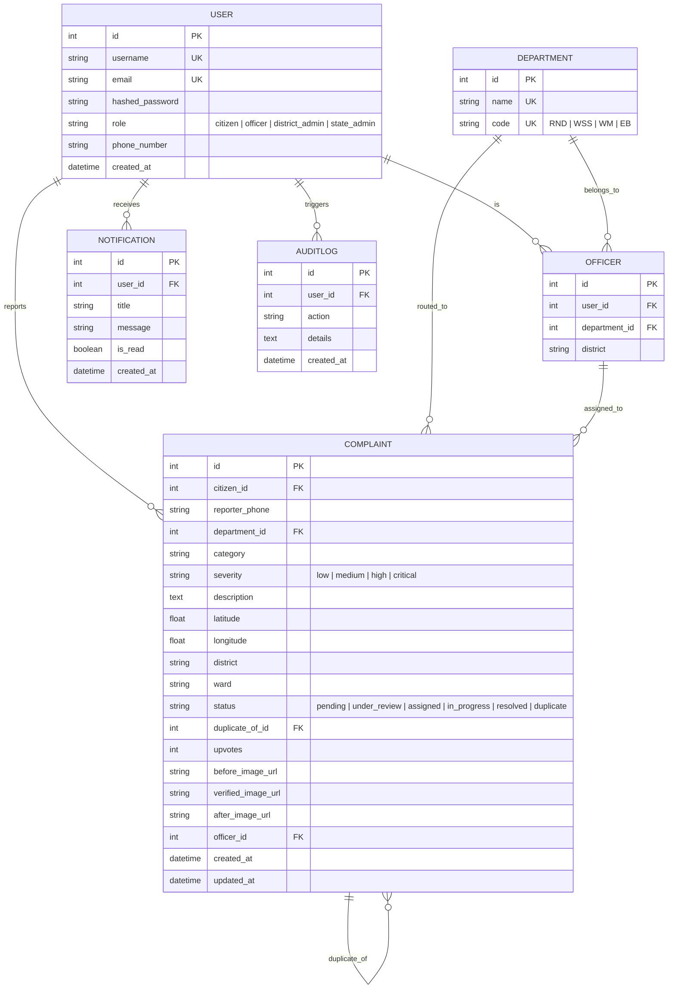

# CiviTrack AI: Comprehensive Project Technical System & Architecture Overview

> **Purpose**: This document provides a complete, self-contained technical specification of the **CiviTrack AI** codebase. It is designed to provide full context to developers and AI models (LLMs) reviewing or working on this codebase.

---

## 1. Executive Summary & Core Concept

**CiviTrack AI** is an AI-driven municipal infrastructure monitoring, automated defect detection, spatial deduplication, and issue resolution platform. It bridges citizens with government department field officers and municipal administrators.

### Core Objectives & Value Proposition
* **Automated Zero-Touch Issue Dispatching**: Citizens upload photos of infrastructure defects (e.g., potholes, garbage, open manholes, broken streetlights). AI models classify the issue, assign severity, and route it to the responsible department automatically.
* **Geospatial Deduplication (Haversine 50m Rule)**: Prevents duplicate municipal task allocation by detecting new submissions within a 50-meter radius of existing open issues and merging them with upvotes/subscriber links.
* **Visual Auditability & Transparency**: Field officers submit "after" photos upon repair completion, enabling interactive Before/After image comparison sliders for citizens and admins.
* **Multi-Channel Accessibility**: Supports reporting via a web portal as well as a simulated WhatsApp conversational bot interface.
* **Real-time Synchronization**: WebSockets push status updates (`Assigned`, `In Progress`, `Resolved`) dynamically to UI dashboards.

---

## 2. Full Technology Stack

### Backend Stack
* **Language & Framework**: Python 3.10+, FastAPI (Asynchronous ASGI framework), Uvicorn ASGI server.
* **Database & ORM**: MySQL database, SQLAlchemy 2.0 ORM, Pydantic v2 schemas for request/response serialization.
* **Authentication**: JWT (JSON Web Tokens) with `python-jose` and `passlib` (bcrypt password hashing).
* **AI / Deep Learning Core**:
  * **Vision Model**: Ultralytics YOLOv8 via PyTorch.
  * **Image Pre-processing**: OpenCV (CLAHE contrast stretching, resizing, and noise reduction) and PyTorch vision tensors.
  * **Generative NLP / Chatbot**: Regex intent parser, dynamic SQL context injection, OpenAI/Gemini API integration (with template fallback engine).
* **Real-Time Communication**: HTML5 WebSockets.

### Frontend Stack
* **Framework**: React 19, TypeScript 6, Vite 8 build pipeline.
* **Styling**: Tailwind CSS 3.4, `@fontsource-variable/inter`, Lucide React icons (`lucide-react`), Shadcn UI primitives, custom dark/cyberpunk aesthetic.
* **Spatial & Geospatial Rendering**: Leaflet 1.9, React-Leaflet 5, OpenStreetMap API tiles.
* **Charts & Analytics**: Recharts 3.9.
* **Routing**: React Router DOM v7.

---

## 3. System Architecture & Workflows

### A. AI Detection Pipeline
```
[Citizen Image Upload + GPS] 
       │
       ├──► Custom-Trained YOLOv8 Model (CivicSense_5class_best.pt)
       │      │
       │      ├── Preprocess with OpenCV (CLAHE + Gaussian Blur)
       │      ├── Infer with 5-class Model (Pothole, Water Leak, Garbage, Fallen Tree, Streetlight)
       │      ├── Filter detections by Confidence Score (> 0.45)
       │      └── Select Highest-Scoring Predicted Category
       │
       ├──► Severity & Department Mapping
       ├──► LLM/Template Dispatcher Note Generation
       └──► Haversine Proximity Check (50m Radius)
              │
              ├── Duplicate Found ──► Attach to Parent Complaint (Status: duplicate, +1 Upvote)
              └── Unique Issue ────► Persist to DB (Status: pending)
```

#### Defect Categories & Department Routing Policy
| Defect Category | Assigned Department | Default Severity | Key Hazards / Dispatch Notes |
| :--- | :--- | :--- | :--- |
| **Open Manhole** | Water Supply & Sewerage (`WSS`) | `critical` | Severe pedestrian/vehicle fall risk |
| **Flooded Road** | Water Supply & Sewerage (`WSS`) | `critical` | Hydroplaning & traffic disruption |
| **Electric Pole Damage** | Electricity Board (`EB`) | `critical` | Electrocution & fire hazard |
| **Pothole / Road Damage** | Roads & Buildings (`RND`) | `high` | Vehicle rim & tire damage |
| **Water Leakage** | Water Supply & Sewerage (`WSS`) | `medium` | Water loss & surface erosion |
| **Garbage Accumulation** | Waste Management (`WM`) | `medium` | Sanitation hazard & disease vector |
| **Fallen Tree** | Roads & Buildings (`RND`) | `medium` | Lane obstruction |
| **Broken Streetlight** | Electricity Board (`EB`) | `low` | Nighttime visibility hazard |
| **Broken Traffic Sign** | Roads & Buildings (`RND`) | `low` | Traffic confusion |

---

## 4. Database Schema & Data Models

The system relies on six interconnected MySQL tables managed via SQLAlchemy (`backend/app/models.py`):



---

## 5. Directory Structure & Code Organization

```
antimajor/
├── backend/
│   ├── app/
│   │   ├── ai/
│   │   │   ├── detector.py      # Preprocessing (OpenCV) & 3 YOLOv8 model inference logic
│   │   │   ├── duplicates.py    # Haversine formula proximity check (50m radius)
│   │   │   └── generator.py     # Automated AI dispatcher description generator
│   │   ├── routers/
│   │   │   ├── analytics.py     # Admin analytics, SLA adherence, load metrics
│   │   │   ├── auth.py          # User register, login, JWT token issuance
│   │   │   ├── chatbot.py       # Conversational AI query engine over complaints DB
│   │   │   ├── community.py     # Upvoting, comments, public feed
│   │   │   ├── complaints.py    # Main lifecycle router (upload, analyze, assign, resolve)
│   │   │   ├── departments.py   # Department list endpoints
│   │   │   └── ws.py            # WebSockets manager & event broadcaster
│   │   ├── auth.py              # JWT utility functions
│   │   ├── crud.py              # Database query abstractions
│   │   ├── database.py          # SQLAlchemy session setup
│   │   ├── main.py              # FastAPI app initialization, CORS, static mounts
│   │   ├── models.py            # Database tables definition
│   │   └── schemas.py           # Pydantic data schemas
│   ├── uploads/                 # Stored uploaded before/after defect images
│   │   # MySQL database schemas used
│   ├── seed_db.py               # Database seeder with realistic sample complaints
│   ├── seed_demo_users.py       # Pre-seeded users (citizen, officers, admins)
│   ├── requirements.txt         # Python dependencies
│   └── run.py                   # Server start script (Uvicorn launcher)
│
├── frontend/
│   ├── src/
│   │   ├── components/
│   │   │   ├── AdminDashboard.tsx      # Admin metrics, spatial heatmaps, SLA tracking
│   │   │   ├── AgenticAICenter.tsx     # AI pipeline monitoring interface
│   │   │   ├── AnalyticsDashboard.tsx  # SLA charts & category breakdown
│   │   │   ├── AuthPortal.tsx          # Login & registration portal
│   │   │   ├── BeforeAfterSlider.tsx   # Visual resolution verification slider
│   │   │   ├── ChatBot.tsx             # Floating AI assistant widget
│   │   │   ├── CitizenPortal.tsx       # Citizen defect reporting form & map
│   │   │   ├── CommunityBoard.tsx      # Social upvoting & discussion panel
│   │   │   ├── GovDashboard.tsx        # Department officer task management console
│   │   │   ├── LiveCityMap.tsx         # Interactive Leaflet map with colored pins
│   │   │   └── WhatsAppSimulator.tsx   # Simulated WhatsApp bot reporting chat UI
│   │   ├── App.tsx                     # Main router & role switching state
│   │   ├── index.css                   # Global styles & theme definitions
│   │   └── main.tsx                    # React entry point
│   ├── package.json                    # Node dependencies
│   └── vite.config.ts                  # Vite build configuration
│
└── Documentation Files:
    ├── project_description.md         # Comprehensive project description
    ├── detection_and_workflow.md      # Mermaid workflow charts & detection pipeline
    ├── image_detection_logic.md       # Math formulas, prompt list, softmax logic
    └── detailed_system_explanation.md # Deep dive architectural guide
```

---

## 6. Primary API Endpoints Reference

| Method | Path | Auth Required | Description |
| :--- | :--- | :--- | :--- |
| `POST` | `/api/auth/register` | No | Creates a new user account (Citizen or Officer) |
| `POST` | `/api/auth/token` | No | Login endpoint, returns JWT access token |
| `POST` | `/api/complaints/analyze` | Yes | Uploads image + lat/lng; runs OpenCV preprocessing, runs three YOLOv8 models, generates note & duplicate check |
| `POST` | `/api/complaints/create` | Yes | Saves finalized complaint to MySQL database |
| `GET` | `/api/complaints/` | Optional | Queries complaints (supports filters: `category`, `status`, `district`, `ward`, `severity`) |
| `GET` | `/api/complaints/{id}` | Optional | Retrieves single complaint detail by ID |
| `PUT` | `/api/complaints/{id}/assign` | Officer/Admin | Assigns issue to field officer |
| `PUT` | `/api/complaints/{id}/resolve` | Officer | Submits resolution, uploading "after" photo |
| `POST` | `/api/complaints/{id}/upvote` | Citizen | Upvotes issue, incrementing community priority |
| `POST` | `/api/chatbot/query` | Optional | Processes natural language queries against complaints database |
| `GET` | `/api/analytics/dashboard` | Admin | Computes overall SLA adherence, resolution rates, and departmental loads |
| `WS` | `/ws/{user_id}` | No | WebSocket connection for real-time notification events |

---

## 7. How to Run the Project Locally

### 1. Backend Setup
```bash
cd backend
python -m venv venv
# On Windows PowerShell:
.\venv\Scripts\Activate.ps1

pip install -r requirements.txt
python seed_demo_users.py
python seed_db.py
python run.py
```
* Backend runs at `http://localhost:8000`. API docs available at `http://localhost:8000/docs`.

### 2. Frontend Setup
```bash
cd frontend
npm install
npm run dev
```
* Frontend runs at `http://localhost:5173`.

---

## 8. Summary for Context Transfer to Other AI Models

If handing this context off to another AI model, emphasize:
1. **Domain**: Municipal infrastructure monitoring system (Civic Tech / Smart Governance).
2. **Key Backend Mechanism**: `FastAPI` + `SQLAlchemy` + `MySQL` + `PyTorch` (3 custom-trained YOLOv8 models) for image defect classification + Haversine 50m spatial deduplication.
3. **Key Frontend Mechanism**: `React 19` + `TypeScript` + `Tailwind CSS` + `React-Leaflet` maps + WebSockets live updates.
4. **Key Features**: Auto-classification, duplicate merging, dispatcher note generation, field officer resolution with before/after photo slider, citizen community upvoting, NLP chatbot query router, and WhatsApp Cloud API integration.
